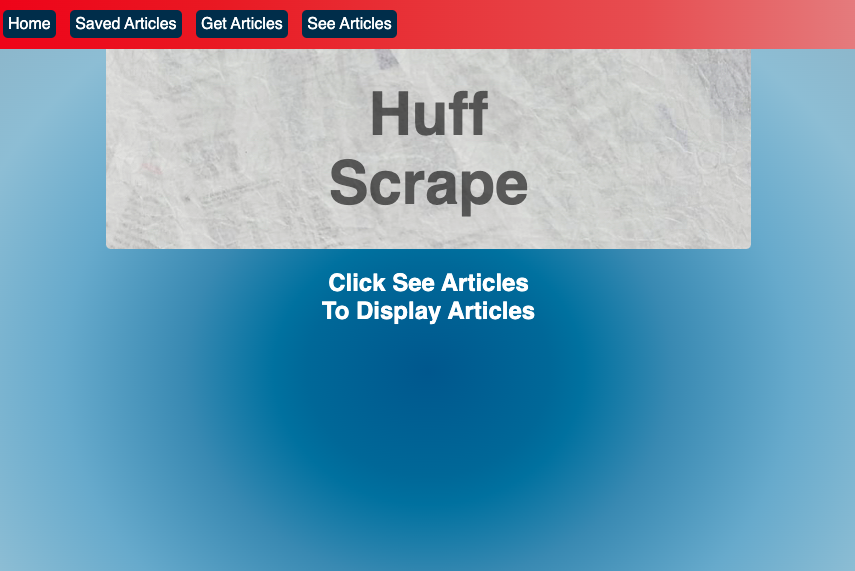
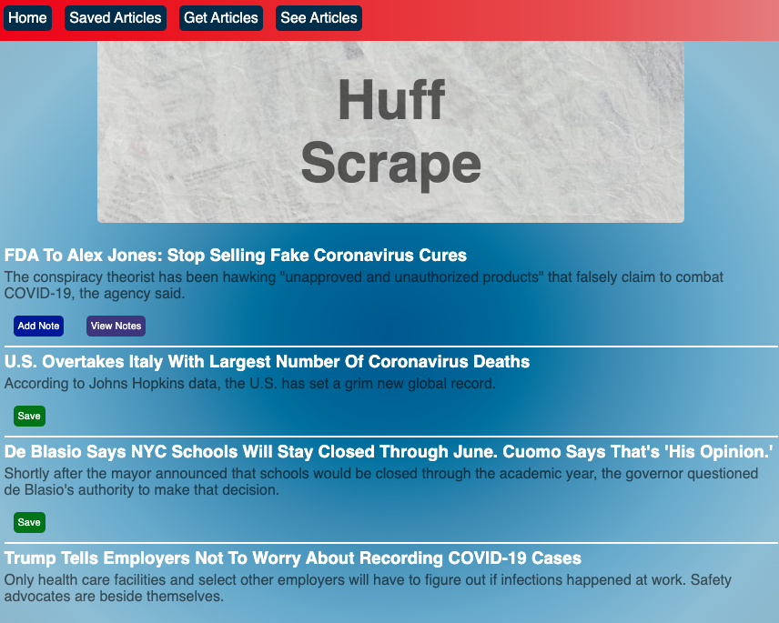
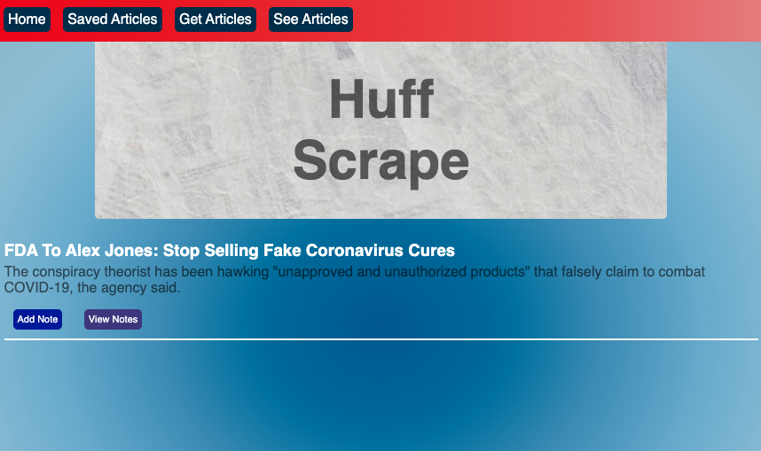
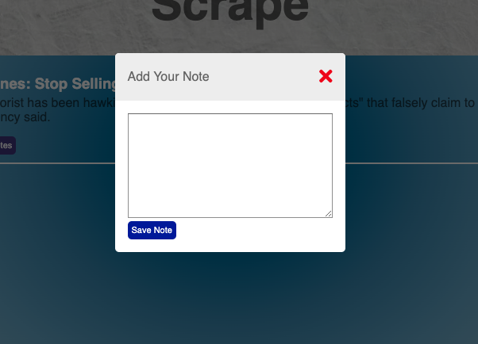

# 
Huffpost-Scraped

## App Visuals

## Overview

Web scraping application that gathers the title and links to articles from the Huffington Post website. The site allows users to save, make notes on the articles, and view the notes all on a single page style application.

### Technologies Used

1. Node.js
2. MongoDB
3. Mongoose ORD
4. Handlebars
5. Cheerios *for scraping*

## How to use application 

To run the application locally first clone this repository to your local machine then run `npm install`. 
Once dependencies have been installed insure that `mongoDB` is installed on your machine. Navigate to the root of the project then in the terminal run `npm start` and navigate to `http://localhost:4000` in your browser.
Otherwise to use the application on the web [click here](https://quiet-shelf-47328.herokuapp.com/ "Heroku Deployed Page")
